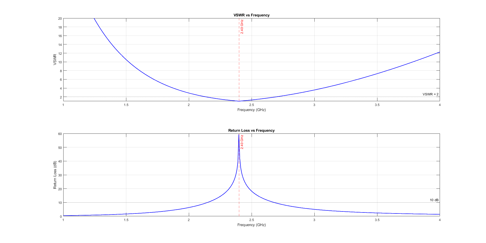

# Smith Chart & Impedance Matching Calculator — MATLAB

A self-contained MATLAB toolkit for RF impedance matching visualization and design.

## What's Inside

| File                     | Purpose                                                         |
|--------------------------|------------------------------------------------------------------|
| `src/plotSmithChart.m`   | Draw a Smith chart; overlay impedance points & frequency sweeps |
| `src/matchImpedance.m`   | L-network & single shunt-stub matching calculator               |
| `src/rfMetrics.m`        | VSWR, return loss, mismatch loss from any impedance             |
| `examples/ex_basic.m`    | Plot 7 reference impedances; print RF metrics table             |
| `examples/ex_matching.m` | L-network matching: 100−j30 Ω → 50 Ω @ 2.4 GHz                 |
| `examples/ex_sweep.m`    | Frequency-sweep spiral (RLC antenna model, 1–4 GHz)             |
| `examples/ex_stub.m`     | Shunt-stub matching with physical microstrip lengths            |

---

## Examples

### Example 1: Basic Impedance Points

Plot multiple impedances on the Smith chart:


### Example 2: L-Network Matching

Impedance matching from 100−j30 Ω to 50 Ω at 2.4 GHz:


### Example 3: Frequency Sweep

RLC antenna impedance trace across 1–4 GHz on the Smith chart.
The spiral starts at 1 GHz (highly mismatched, near the rim) and
tightens toward the centre as frequency approaches resonance at 2.40 GHz:


VSWR and Return Loss vs frequency for the same RLC antenna model.
The antenna resonates at 2.40 GHz where VSWR reaches its minimum and
return loss peaks at ~42 dB, indicating near-perfect matching.
The −10 dB bandwidth (VSWR < 2) spans roughly 200–300 MHz around resonance:


### Example 4: Shunt-Stub Matching

Single shunt-stub matching at 2.4 GHz. The load Z_L = 25+j30 Ω is
transformed to 50 Ω using a shunt stub placed at distance d from the load:



---

## Quick Start

```matlab
% 1. Add src/ to your path
addpath('src')

% 2. Draw a blank Smith chart
plotSmithChart()

% 3. Plot an antenna impedance at 2.4 GHz
ZL = 100 - 30j;          % antenna impedance (ohms)
plotSmithChart('Z0', 50, 'Points', ZL, 'Labels', {'Z_ant'})

% 4. Calculate L-network matching to 50 Ω
matchImpedance(ZL, 50, 2.4e9)

% 5. Get VSWR and return loss
rfMetrics(ZL, 50)
```

---

## Key Concepts

### The Smith Chart

The Smith chart maps any complex impedance *Z = R + jX* to the complex
reflection coefficient:
