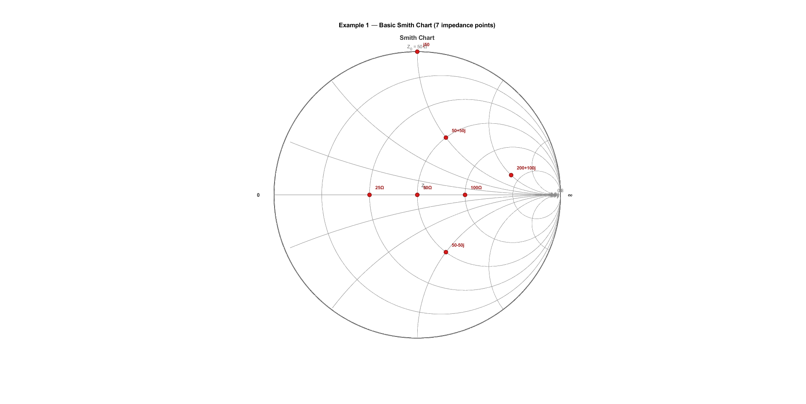
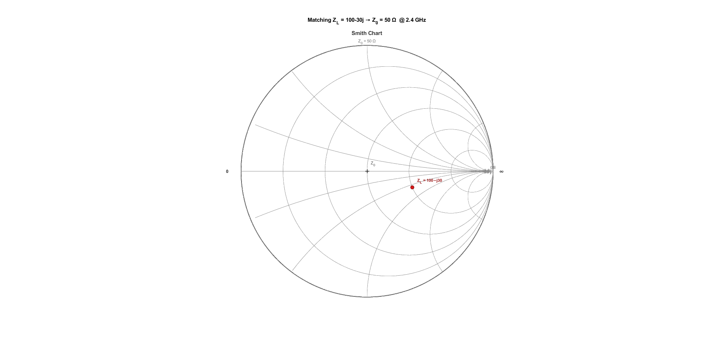
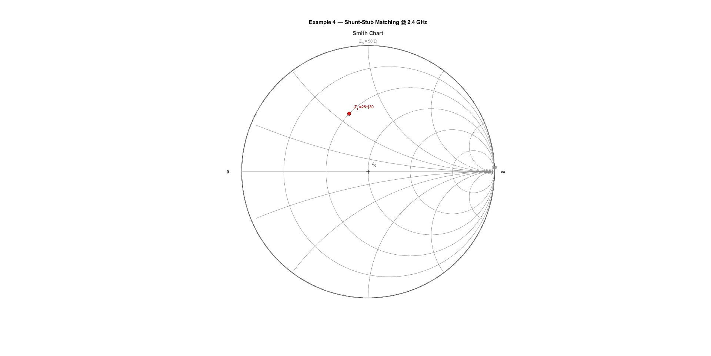
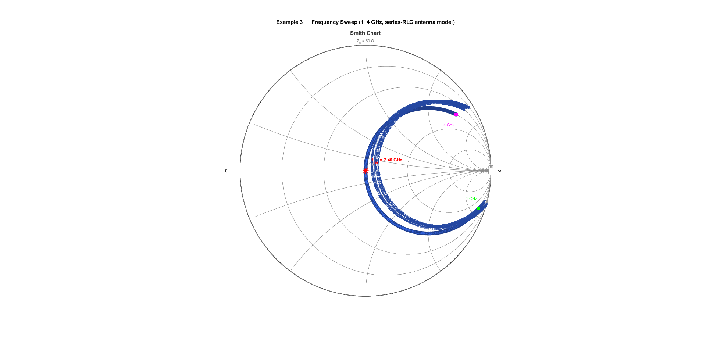

# Smith Chart & Impedance Matching Calculator — MATLAB

A self-contained MATLAB toolkit for RF impedance matching visualization and design.

## What's Inside

| File | Purpose |
|------|----------|
| `src/plotSmithChart.m` | Draw a Smith chart; overlay impedance points & frequency sweeps |
| `src/matchImpedance.m` | L-network & single shunt-stub matching calculator |
| `src/rfMetrics.m` | VSWR, return loss, mismatch loss from any impedance |
| `examples/ex_basic.m` | Plot 7 reference impedances; print RF metrics table |
| `examples/ex_matching.m` | L-network matching: 100−j30 Ω → 50 Ω @ 2.4 GHz |
| `examples/ex_sweep.m` | Frequency-sweep spiral (RLC antenna model, 1–4 GHz) |
| `examples/ex_stub.m` | Shunt-stub matching with physical microstrip lengths |

---

## Examples

### Example 1: Basic Impedance Points
Plot multiple impedances on the Smith chart:



### Example 2: L-Network Matching
Impedance matching from 100−j30 Ω to 50 Ω:



### Example 3: Frequency Sweep
RLC antenna impedance trace across 1–4 GHz:



### Example 4: Shunt-Stub Matching
Single shunt-stub matching at 2.4 GHz:



---

## Quick Start

```matlab
% 1. Add src/ to your path
addpath('src')

% 2. Draw a blank Smith chart
plotSmithChart()

% 3. Plot an antenna impedance at 2.4 GHz
ZL = 100 - 30j;          % antenna impedance (ohms)
plotSmithChart('Z0', 50, 'Points', ZL, 'Labels', {'Z_ant'})

% 4. Calculate L-network matching to 50 Ω
matchImpedance(ZL, 50, 2.4e9)

% 5. Get VSWR and return loss
rfMetrics(ZL, 50)
```

---

## Key Concepts

### The Smith Chart

The Smith chart maps any complex impedance *Z = R + jX* to the complex
reflection coefficient:

```
Γ = (z − 1) / (z + 1),    z = Z / Z0
```

- **Centre** of the chart → Z = Z₀ (perfect match, Γ = 0)
- **Right edge** → Z = ∞ (open circuit, Γ = +1)
- **Left edge** → Z = 0 (short circuit, Γ = −1)
- **Circles** = constant resistance (*r = const*)
- **Arcs** = constant reactance (*x = const*)

### L-Network Matching

An L-network places **two reactive elements** (one shunt, one series)
to transform an arbitrary Z_L to Z₀. There are always two solutions
(high-pass and low-pass topology).

The network Q is:

```
Q = sqrt(Z_hi / Z_lo − 1)
```

where Z_hi and Z_lo are the larger and smaller of R_L and Z₀.

### Single Shunt Stub

A shunt stub places a short section of transmission line in parallel
with the main feed line at distance *d* from the load:

1. Find *d* so that `Re{Y_in(d)} = Y₀`
2. Choose stub length *l* so that `Im{Y_stub} = −Im{Y_in(d)}`

---

## plotSmithChart Options

```matlab
plotSmithChart( ...
    'Z0',          50,          ...  % reference impedance (Ω)
    'Points',      Z_array,     ...  % complex impedances to plot
    'Labels',      {'Z1','Z2'}, ...  % text labels (cell array)
    'ConnectDots', true,        ...  % join points with a line
    'PointColor',  [0.9 0.1 0.1], ... % RGB colour for dots
    'LineColor',   [0.2 0.4 0.9])     % RGB colour for sweep line
```

---

## matchImpedance Output

```
══════════════════════════════════════════
  Impedance Matching Calculator
══════════════════════════════════════════
  ZL      = 100.00 -30.00 j  Ω
  Z0      = 50.00 Ω
  Freq    = 2.4 GHz
  |Γ_L|   = 0.3922  (8.13 dB RL)
  VSWR_L  = 2.291
──────────────────────────────────────────

  Solution 1 — L-net (shunt-at-load), Q=1.000, sgn=+1
    L_series = 4.320 nH
    C_shunt  = 0.854 pF
  |Γ_in|  = 3.24e-10  (matched)

  Solution 2 — L-net (shunt-at-load), Q=1.000, sgn=-1
    C_series = 2.120 pF
    L_shunt  = 13.26 nH
  |Γ_in|  = 2.81e-10  (matched)
══════════════════════════════════════════
```

---

## Requirements

- **MATLAB R2019b or later** (uses `inputParser`)
- No toolboxes required for core functions
- Optional: RF Toolbox and Antenna Toolbox for advanced features

---

## License

MIT
